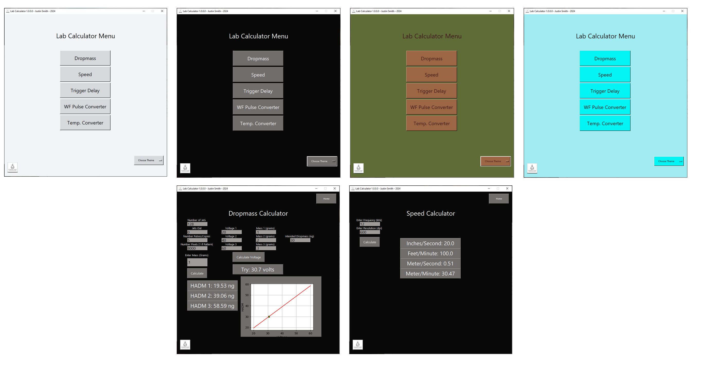
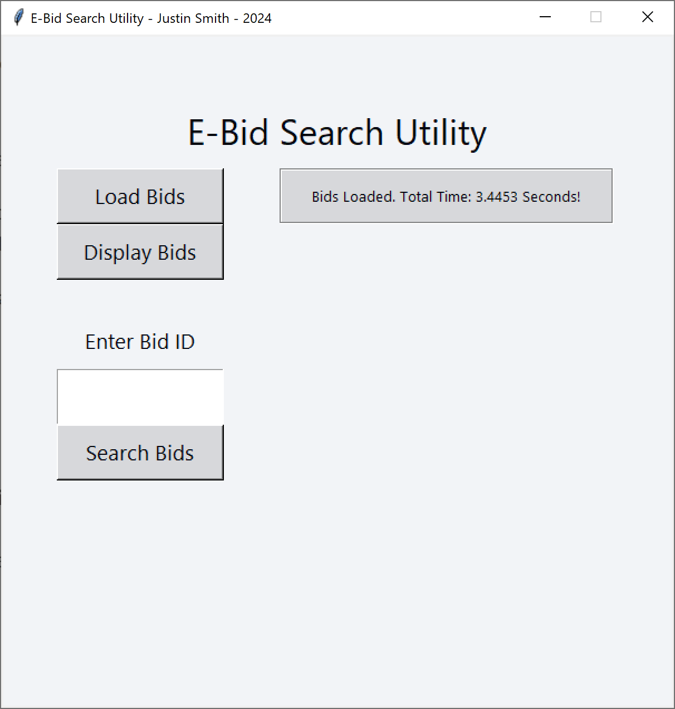
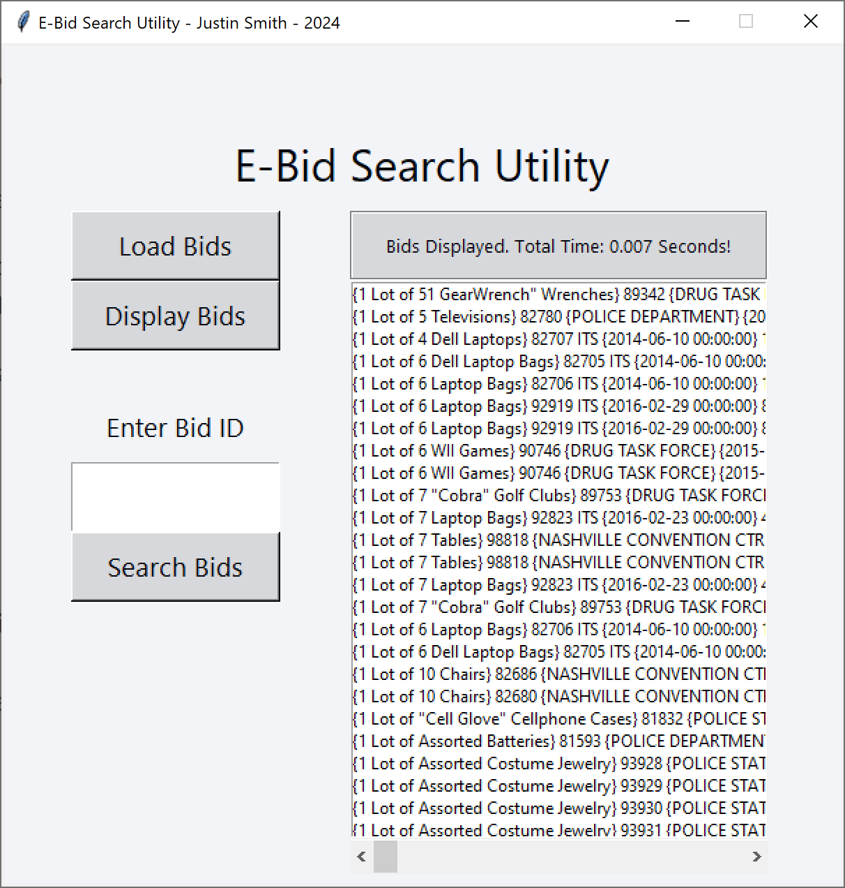
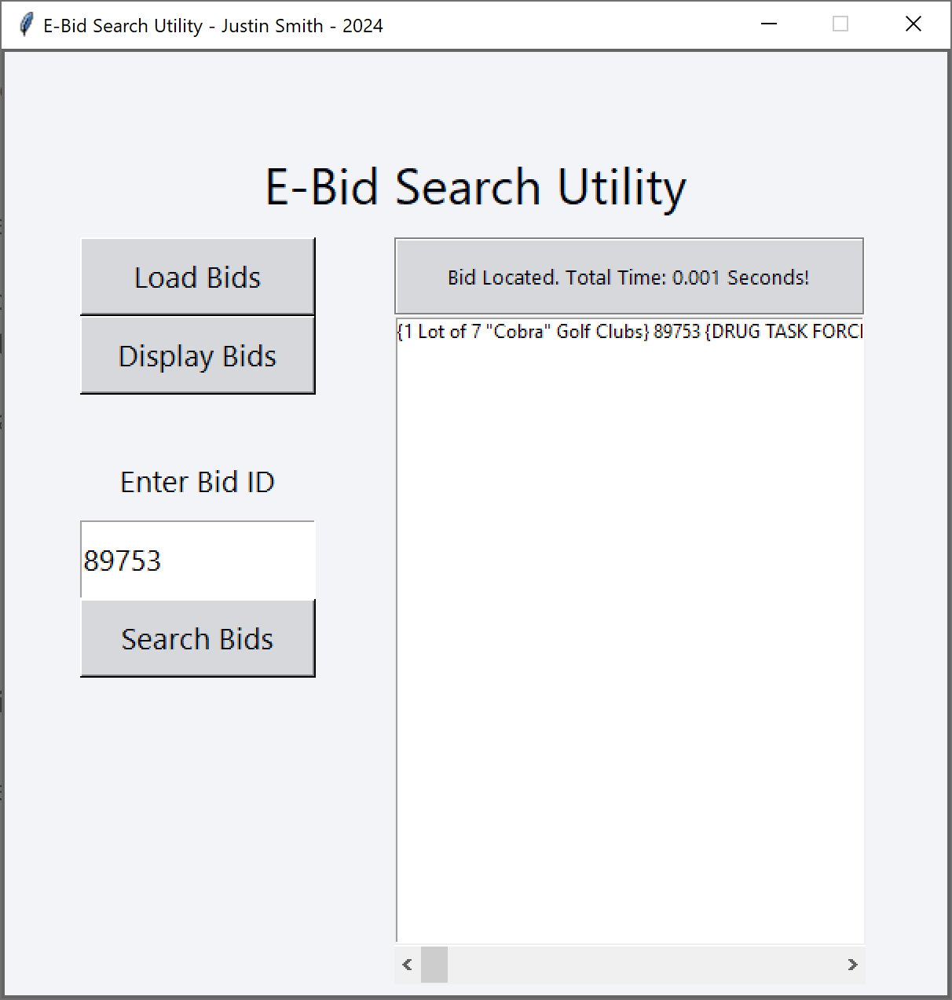

# SNHU CS-499 Capstone
***SNHU - BS Computer Science Capstone ePortfolio for Justin Smith***

This site was built using [GitHub Pages](https://pages.github.com/).

# Self Introduction

# Code Review

# Enhancement One: Software Design/Engineering
[Click Here For Source Code](https://github.com/JurassicJaws1989/SNHU_CS499_Capstone/tree/main/Software_Engineering_and_Design)

For the software design and engineering element, I decided to choose a calculator application I wrote in Python back in 2020. This was the first real application I created, and one of my earliest creations in Python. The calculator provides process improvements in a laboratory environment and hosts relatively simply functionality in an easy to use interface. 
My reasoning for choosing this element comes from the fact that I did not have the knowledge set I have now when I initially created this application. It was in desperate need of both a functionality overhaul, along with massive improvements in terms of how the code itself was written. One of the biggest elements that I changed within this application that show off my current skillset is the complete rewriting of the application’s code. During the enhancement, I was able to do the following,
*	Adjust variable/function names to adhere to a standard practice
*	Add in commenting and documentation
*	Reduce/eliminate redundant code blocks with better use of function calls

By doing this, the code is much more clean and readable, and more effective in the process. 
Another aspect that I enhanced shows off my ability to adhere to best practices in UI/UX principles by greatly improving the user interface of this application. I was able to consolidate the entire application within a single window, cleaning up the interface significantly. I also performed a complete overhaul of the “theme” selection within the utility, making it not only more user friendly when choosing the customizable layout, but much easier to add in new themes on a programming end. 
By performing this enhancement, I was able to meet the objectives I had previously planned. These surrounded demonstrating the execution of properly written code that is readable, maintainable, and functional, along with fully displaying my knowledge on creating a fully functional user interface that adheres to best practices. I was able to demonstrate that I am meeting the following course outcomes,

* Design and evaluate computing solutions that solve a given problem using algorithmic principles and computer science practices and standards appropriate to its solution while managing the trade-offs involved in design choices
* Demonstrate an ability to use well-founded and innovative techniques, skills, and tools in computing practices for the purpose of implementing computer solutions that deliver value and accomplish industry-specific goals
  
While working through the enhancement process, I was met with challenges throughout the process (as to be expected with any project). The first real challenge was dealing with the original code. As I mentioned, this was written exclusively by myself quite a few years ago. This was before I had any real experience in programming. Due to this, I found it difficult to recall what exactly was going on within this code, especially given the lack of commenting and poor readability within the code. I had to instead use the original application’s functionality as a basis/starting point, and re-write the code entirely from the ground up. This added time, but made the enhancement much easier in the end. 
I also ran into some minor trouble with the execution of the theme selection within the utility. In the previous code, I was calling multiple configuration function calls throughout when users would select a new color scheme via a button press. This was messy, both in the interface, and in the code. I wanted instead to feature a theme dropdown on the main menu, and store specific widget colors as variables. At first, I found difficulty in passing these color variables throughout all of the various screens. I was able to overcome this by declaring them globally within the theme function definition. Although I found this a bit more challenging than simply calling colors via button clicks, it was more rewarding when it became functional. It also looks significantly better within the application. 
Attached, you will find some screenshots that detail the enhanced utility in operation. 

# Enhancement Two: Algorithms and Data Structure
[Click Here For Source Code](https://github.com/JurassicJaws1989/SNHU_CS499_Capstone/tree/main/Algorithms_and_Data_Structures)

The artifact I chose for the Algorithms and Data Structure element is from a project that we worked on during CS-260 (Data Structures and Algorithms). Specifically, from module six, where we were tasked with creating a binary search tree function in C++ that interacts with a large data structure of electronic bids. The emphasis of the assignment was to understand how a binary tree search works, and to showcase its improvement in terms of speed when searching large data structures. We were also tasked with creating a test interface within the terminal to interact with the functionality. The functionality we were tasked on adding was,
*	Load Bids – read in data from .csv file and appropriately add it to a binary tree
*	Display Bids – display all bids in record
*	Find Bid – perform the search within the binary search tree by entering a bid ID
*	Display Time – record and display the elapsed time of the search

One of the major reasons I chose this artifact was the fact that I did not completely recall how this search function worked. I wanted to use this exercise as a means to familiarize myself with this particular algorithm, along with challenge myself with attempting to port this functionality to an entirely different language, Python. Furthermore, since this original artifact only had a test interface within the terminal, I wanted to further showcase my skills in creating a user focused utility to house this functionality. I was glad that I made this choice, as I now feel very comfortable with the understanding of how this search algorithm works, and why it is able to drastically improve search times. Although challenging at first, I am also quite impressed with my ability to recreate this functionality in Python.
After creating the binary search tree class, I was also able to wrap everything up within a fairly standard, yet functional user interface. The following screenshots provide this in more detail,

# LOAD BIDS:

# DISPLAY BIDS:

# SEARCH BIDS:

I was able to meet the objectives I laid out for myself for this enhancement, and found it to be extremely rewarding albeit a bit challenging at times. Some of the challenges I faced initially surrounded my initial unfamiliarity with how the class was defined and how the algorithm operates. My initial comments within the original C++ element did not provide me with enough detail to hit the ground running. With a little research back into the resources for CS-260, I was able to better understand this. I also ran into an issue with the way my BST was being created. I was inserting bids (keys) into the tree depending on the size of the overall tuple. This ended up making it impossible to correctly traverse the tree when searching for ID numbers specifically. I ended up having to get creative within the search to correctly traverse, yet still identify specific bid ID numbers (and still maintain high speed). This ended up being useful as I progress to the third enhancement element, where I will further improve the ability to both search and interact with this relatively large data structure. 

# Enhancement Three: Database
[Click Here For Source Code](https://github.com/JurassicJaws1989/SNHU_CS499_Capstone/tree/main/Database)

The element for my third and final enhancement, the database element, was a follow up on my previously enhanced element, the electronic bid search function. It originated as a simple terminal based binary search tree function in C++. In the last milestone, I ported this functionality over to Python and created an interface to interact with the ID search.
What I wanted to do with this further enhancement, was to completely overhaul the search and display functionality for this large dataset, and make it more user interactive within the utility. I ended up making use of a Pandas data frame to interact with this data set, and made it more visible within the utility in a nice tabular view. Furthermore, I added the functionality to sort the dataset by numerous fields via a radio button click. Now, as for the search functionality, one thing I wanted to enhance within this utility was to allow for the user to search for more than just the ID. So, I added the ability to search by numerous fields via a drop down, in which the program will display all of the bids that match the specified criteria. 
I also wanted to add some level of protection to this utility by making it password protected. So, the user must enter a password before being allowed access to the utility’s functionality. So, let’s take a look at the end result,
# Password Functionality
The user enters the correct password before access is granted.

